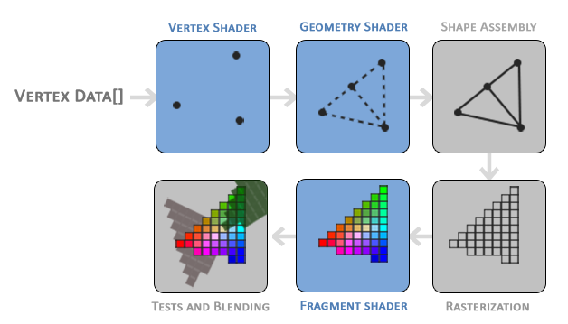

# 🔺Simple 3D triangle

Vamos visualizar esse triângulo usando um plano cartesiano simples em 2D com os vértices que você passou:

```cpp
float vertices[] = {
    -0.5f, -0.5f, 0.0f,  // V0: canto inferior esquerdo
     0.5f, -0.5f, 0.0f,  // V1: canto inferior direito
     0.0f,  0.5f, 0.0f   // V2: topo central
};
```

## 🟦 Visualização (esquemática)

```txt
  Y ↑
      |
  0.5 |         (V2)
      |           ●
      |          / \
      |         /   \
  0.0 |--------●-----●--------→ X
      |      (V0)   (V1)
 -0.5 |     
      |
```

## 📌 Posições dos vértices

Vértice	Coordenada (x, y)	Posição
V0	(-0.5, -0.5)	canto inferior esquerdo
V1	( 0.5, -0.5)	canto inferior direito
V2	( 0.0, 0.5)	topo central

## 🔺 Forma
É um triângulo isósceles apontando para cima

Ele está centralizado horizontalmente

O OpenGL usa por padrão o espaço de coordenadas normalizado (NDC), que vai de -1 a 1 nos eixos X e Y


